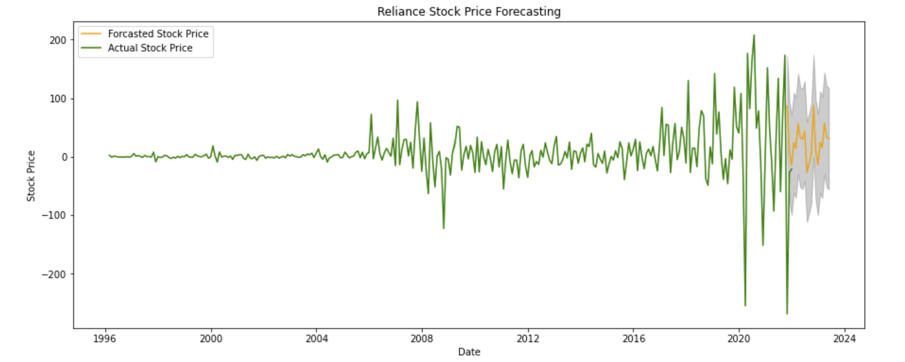
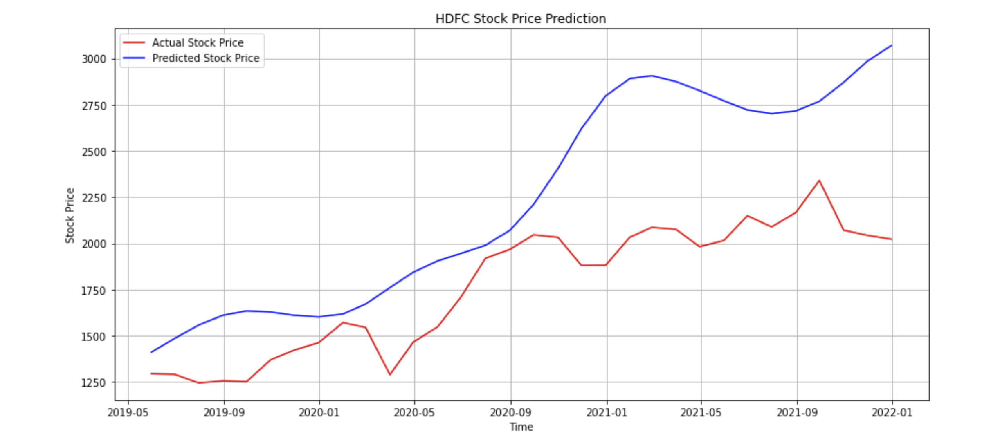

## Stock Market Prediction 

## Overview 
In this project, I'll be using Time Series models and LSTM models to predict on the closing price of stocks of different companies.

## Business Statement
StockAI is a startup aiming to provide detailed analysis to long-term investors who are keen to understand the fluctuation of stock prices in the near future.

## Analysis and Methodology
In this project, I will pick certain stocks from different datasets and predict/forecast their closing prices to the best accuracy. I will be using Time Series Analysis and LSTM model from keras for the closing prices and understand the seasonality and trend of the time series to further use the right parameters for Machine Learning Algorithm.

## Results

Prediction using SARIMAX model on Reliance Stock.

Prediction using LSTM model on HDFC Stock.

## Conclusion and Recommendations
From the project, I have derived the following conclusions:
> - The historical data of stock prices should atleast start from 2010 to derive effective inferences.
> - Taking monthly mean is effective if an investor is looking for long term benefits.
> - The models have an accuracy of 60-70%, which will provide net gains over a long period of time.

Here are some of my recommendations to an investor:
> - Order large quantities of stocks for analysis to have a collection of stocks before investing in a single stock.
> - Carefully understand the trend of the stocks before investing as it will determine the kind of profit you will be making.
> - Rather than investing a lumpsum amount in a single stock, diversify to different stocks with limited amounts to receive net gains over a long period of time.

## Additional information
To look for detailed analysis on more stocks, look at this <a href="https://github.com/vinayakmodgil/Capstone-Project/blob/main/capstone-vinayak.ipynb">Jupyter Notebook</a> or look at the <a href="https://github.com/vinayakmodgil/Capstone-Project/blob/main/StockAI-converted.pdf"> presentation. </a>

For additional info, contact me at vinayak.modgil@gmail.com

## Repository Structure
├── data
├── images
├── README.md
├── StockAI-converted.pdf
└── capstone-vinayak.ipynb